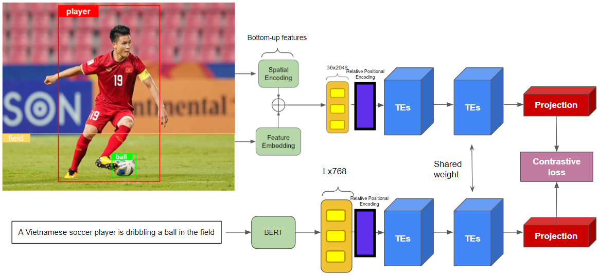
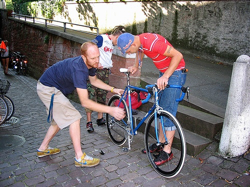

# Cross-modal Retrieval using Transformer Encoder Reasoning Networks & Relative Positional Encoding

This project reimplements the idea from "Transformer Reasoning Network for Image-Text Matching and Retrieval" along with that from "Self-Attention with Relative Position Representations". To solve the task of cross-modal retrieval, representative features from both modal are extracted using distinctive pipeline and then projected into the same embedding space. Because the features are sequence of vectors, Transformer-based model can be utilised to work best. In this repo, my highlight contribution is:
  - Reimplement TERN module, which exploits the effectiveness of using Transformer on bottom-up attention features and bert features.
  - Implement Relative Positional Encoding on both textual and image side.
  - Take advantage of facebookresearch's [FAISS](https://github.com/facebookresearch/faiss) for efficient similarity search and clustering of dense vectors.
  - Experiment various metric learning loss objectives from KevinMusgrave's [Pytorch Metric Learning](https://github.com/KevinMusgrave/pytorch-metric-learning)
  
The figure below shows the overview of the architecture

<p align="center">

</p>

## Datasets

- I trained TERN on Flickr30k dataset which contains 31,000 images collected from Flickr, together with 5 reference sentences provided by human annotators for each image. 
For each sample, visual and text features are pre-extracted as numpy files

- Some samples from the dataset:

| Images | Captions |
|:-------------------------:|:-------------------------:|
|  | 1. An elderly man is setting the table in front of an open door that leads outside to a garden.<br> 2. The guy in the black sweater is looking onto the table below.<br> 3. A man in a black jacket picking something up from a table.<br> 4. An old man wearing a black jacket is looking on the table.<br> 5. The gray-haired man is wearing a sweater. |
|  | 1. Two men are working on a bicycle on the side of the road.<br>2. Three men working on a bicycle on a cobblestone street.<br>3. Two men wearing shorts are working on a blue bike.<br>4. Three men inspecting a bicycle on a street.<br>5. Three men examining a bicycle.|

## Execution

- Installation
```
pip install -r requirements.txt
```

- Specify dataset paths and model configuration in the [config file](./tools/configs/yaml/tern.yaml)
- See the notebooks below for training, evaluation and inference.

## Notebooks
- For training refer to this [train model notebook](https://github.com/RishiDarkDevil/Joint-Embedding/blob/main/TERN-RPE/TERN-RPE-Train.ipynb)
- For evaluation and training with walkthrough of the entire code with explanation check out [TERN Joint Embedding Notebook](https://github.com/RishiDarkDevil/Joint-Embedding/blob/main/TERN-RPE/TERN-Joint-Embedding-Tinker.ipynb)
- For inference similar to the non-RPE version [here](https://github.com/RishiDarkDevil/Joint-Embedding/blob/main/TERN-RPE/TERN-Non-RPE-Inference.ipynb)

## Results
- To be updated...

## Paper References

```
@misc{messina2021transformer,
      title={Transformer Reasoning Network for Image-Text Matching and Retrieval}, 
      author={Nicola Messina and Fabrizio Falchi and Andrea Esuli and Giuseppe Amato},
      year={2021},
      eprint={2004.09144},
      archivePrefix={arXiv},
      primaryClass={cs.CV}
}
```

```
@misc{anderson2018bottomup,
      title={Bottom-Up and Top-Down Attention for Image Captioning and Visual Question Answering}, 
      author={Peter Anderson and Xiaodong He and Chris Buehler and Damien Teney and Mark Johnson and Stephen Gould and Lei Zhang},
      year={2018},
      eprint={1707.07998},
      archivePrefix={arXiv},
      primaryClass={cs.CV}
}
```

```
@article{JDH17,
  title={Billion-scale similarity search with GPUs},
  author={Johnson, Jeff and Douze, Matthijs and J{\'e}gou, Herv{\'e}},
  journal={arXiv preprint arXiv:1702.08734},
  year={2017}
}
```

## Code References

- https://github.com/facebookresearch/faiss
- https://github.com/KevinMusgrave/pytorch-metric-learning
- https://github.com/huggingface/transformers
- https://github.com/airsplay/py-bottom-up-attention
